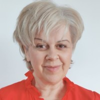
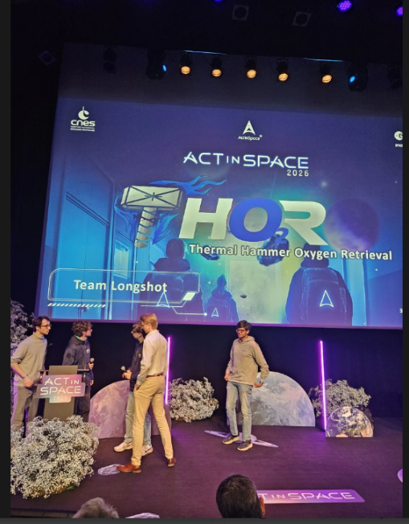

---
hide:
  - toc
  - navigation
---
<!--
CHECKLIST FOR THIS PAGE:
- [ ] Replace [YOUR NAME] with your full name (3 places)
- [ ] Replace [YOUR JOB TITLE] with your current or target role
- [ ] Replace [YOUR TAGLINE] with a short phrase describing your focus
- [ ] Rewrite the About Me paragraph with your own words
- [ ] Replace assets/images/profile.png with your actual photo (keep the filename or update it below)
- [ ] Replace assets/images/about.png with your own image (a field photo, map, or workspace shot)
- [ ] Edit the skill cards to match your actual skills (add, remove, or rename cards as needed)
- [ ] Update GitHub and LinkedIn links in the Connect section
- [ ] Add your CV PDF to docs/assets/ and update the filename in the Download CV button
-->

  
  <h1>Violeta Damjanovic-Behrendt</h1>
  
<strong>Founder & CTO of GreenTwin GmbH</strong>

  
<em>[YOUR TAGLINE — e.g., Turning spatial data into insights | GIS | Remote Sensing | Python]</em>

---

## About Me

I hold a PhD in Computer Science (2008) from the University of Belgrade. 

My professional carrier began in the financial sector, where I worked as a software developer and data analyst (1998–2004), followed by a role as software project manager (2004–2006). Alongside my industry experience in financial technologies, I pursued both my MSc and PhD studies. My MSc thesis was awarded the 2005 Research Prize by the Serbian Society for Informatics, making the beginning of my transition towards a research career. 

In 2006, I joined Salzburg Research, where I contributed to several research departments over the years, including Knowledge and Media Technologies (2006–2014), the Internet of Things Group (2014–2020), Smart Digital Twins (2020–2021), and the Intelligent Connectivity Group (2021–2023). Throughout this period, I was involved in numerous national and European research and innovation projects, advancing digital technologies in areas such as Web agents, Semantic Web technologies, ontology engineering, digital twins, interoperability, and intelligent networked systems.

In 2022, I founded GreenTwin GmbH with the goal of transforming research results and innovative ideas into practical solutions addressing supply chain resilience, sustainability, and digital transformation challenges. This entrepreneurial journey led me to explore the potential of remote sensing, geospatial intelligence, and Earth Observation data analytics for supply chain optimization, risk assessment, and decision support. 

Today, my professional portfolio reflects a unique combination of industrial practice, scientific research, and technology entrepreneurship, with a strong focus on developing data-driven solutions that bridge emerging technologies and real-world societal and industrial needs.

  

---

[View My Projects :material-arrow-right:](projects/index.md){ .md-button .md-button--primary }
[Download CV :material-download:](assets/Violeta-CV.pdf){ .md-button }
[View My Projects :material-arrow-right:](projects/index.md){ .md-button .md-button--primary }
[Download CV :material-download:](assets/Violeta-CV.pdf){ .md-button }

---

## Skills

-   :material-layers:{ .lg .middle } **GIS & Remote Sensing**

    ---

    - QGIS, ArcGIS Pro, Google Earth Engine
    - GDAL / OGR, GRASS GIS
    - Multispectral and SAR image analysis
    - Cloud Native Geospatial (COG, STAC, Zarr)

-   :material-code-braces:{ .lg .middle } **Programming**

    ---

    - Python — GeoPandas, NumPy, Pandas, Matplotlib
    - R — sf, terra, ggplot2
    - JavaScript — Leaflet, MapLibre GL
    - SQL, PostgreSQL + PostGIS

-   :material-star-four-points:{ .lg .middle } **Machine Learning & GeoAI**

    ---

    - Supervised classification — Random Forest, XGBoost
    - Deep learning for image segmentation — U-Net, SAM
    - scikit-learn, PyTorch, TensorFlow
    - Object detection in satellite imagery

-   :material-earth:{ .lg .middle } **Web Mapping & Data**

    ---

    - Leaflet.js, Folium, MapLibre GL JS
    - Cloud storage — AWS S3, Google Cloud Storage
    - Data formats — GeoTIFF, GeoParquet, NetCDF
    - Streamlit for data-driven web apps

-   :material-database:{ .lg .middle } **Data & Cloud**

    ---

    - PostgreSQL + PostGIS
    - Cloud storage: AWS S3, Google Cloud Storage
    - Data formats: GeoJSON, GeoTIFF, NetCDF, Zarr, GeoParquet

-   :material-airplane:{ .lg .middle } **Drone / UAV Data Processing**

    - Mission planning and flight operations
    - Photogrammetry: Agisoft Metashape, OpenDroneMap
    - Point cloud processing: CloudCompare, PDAL

---

## Connect

[GitHub](https://github.com/VDB-GTW){ .md-button }
[LinkedIn](https://linkedin.com/in/vdamjanovic){ .md-button }
